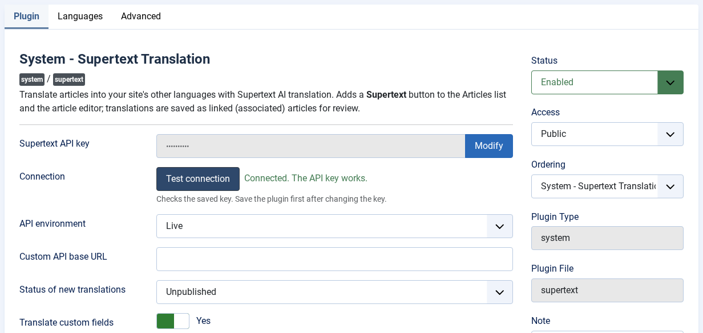
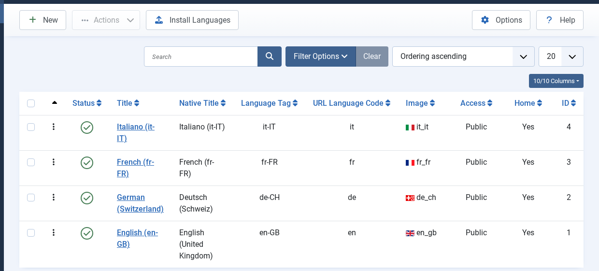
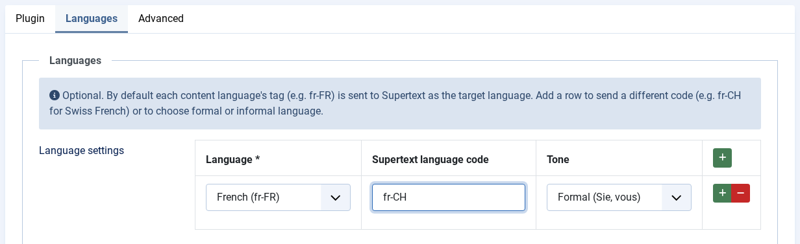

# Installation guide — Supertext Translation for Joomla

For administrators setting up the plugin on a Joomla site.

## Just want to try it?

A ready-to-run container with Joomla 6.1, English sample articles, German (Switzerland), French and Italian, and this plugin is in `demo/`. It is also what runs the public Supertext demo. See the *Demo* section of the [developer guide](DEVELOPER.md#demo-railway).

## Requirements

| | |
| --- | --- |
| Joomla | 6.1 (tested), 5.4 (supported, not yet tested) |
| PHP | Whatever your Joomla version needs (8.3+ for Joomla 6), with `ext-dom` and `ext-curl` (or `allow_url_fopen`) |
| Database | Any database Joomla supports (MySQL, MariaDB, PostgreSQL) |
| Joomla setup | A multilingual site: at least two content languages and *Item Associations* switched on (step 3) |
| Supertext | An account with an API key, see [Get a Supertext account and API key](#get-a-supertext-account-and-api-key) |
| Network | The web server must reach `https://api.supertext.com` over HTTPS |

## 1. Install the plugin

The plugin isn't in the Joomla Extensions Directory yet. Build the package from this repository (or take it from a release):

```bash
./build.sh            # creates dist/plg_system_supertext-<version>.zip
```

Then in Joomla: *System → Install → Extensions → Upload Package File* and drop the zip. Or on the command line:

```bash
php cli/joomla.php extension:install --path=/path/to/plg_system_supertext-0.1.0.zip
```

## 2. Enable it and set the API key

### Get a Supertext account and API key

1. **Account:** no Supertext account yet? [Log in or create one](https://www.supertext.com/person/en/account/signin) with your email address.
2. **API key:** generate it at [supertext.com → Integrations → API](https://www.supertext.com/en/integrations/api). Only users with the **Admin** role in the Supertext account can do this; otherwise ask your Supertext account admin for a key.

The plugin settings link to both pages, next to the API key field.

### Enter it in Joomla

*System → Manage → Plugins*, search for **Supertext**, open **System - Supertext Translation**:

1. Set **Status** to *Enabled*.
2. Click **Modify** next to *Supertext API key*, paste your key and click **Save**. You can paste it exactly as Supertext shows it, with the leading `Supertext-Auth-Key`, or without it.
3. Click **Test connection**. *Connected. The API key works.* means everything is in place.



On servers you can set the key as the environment variable **`SUPERTEXT_API_KEY`** instead. It takes precedence over the field, keeps the key out of the database, and the settings page then says that the environment variable is used.

## 3. Set up the languages

The plugin translates into your site's **content languages** and links the translations with Joomla's **associations**, so the site needs to be multilingual:

1. **Install the language packs** you need: *System → Install → Languages*. Joomla creates a content language for each one.
2. **Publish the content languages**: *System → Manage → Content Languages*.

   

3. **Switch on associations**: *System → Manage → Plugins → System - Language Filter*, enable the plugin and set **Item Associations** to *Yes*.

   

4. Give every content language its own **home page** (a menu item set as *Home* for that language) and add a **Language Switcher** module, so visitors can reach the translations. *Home Dashboard → Multilingual Status* shows what's still missing.

Joomla's own guide covers the details: [Setting up a multilingual site](https://docs.joomla.org/J4.x:Setup_a_Multilingual_Site).

Articles must have a language of their own (not *All*) to be translated.

### Language codes and tone

By default the content language's tag (e.g. `de-CH`, `fr-FR`) is sent to Supertext as the target language. On the plugin's **Languages** tab you can, per content language:

- send a **different code**, e.g. `fr-CH` for Swiss French while the site uses the `fr-FR` language pack, and
- choose the **tone**: *Formal (Sie, vous)*, *Informal (du, tu)* or the Supertext default.



## 4. Check it works

Open *Content → Articles*, tick an article and click **Supertext** (see the [user guide](USER_GUIDE.md)). Or from the command line:

```bash
php cli/joomla.php supertext:translate <article-id> --to=de-CH
```

## Who can translate

Anyone who can **edit** the source article can open the Supertext dialog. Creating a translation also needs **Create** permission in the category the translation goes into; updating an existing translation needs **Edit** (or *Edit Own*) on it. These are Joomla's normal article permissions (*Content → Articles → Options → Permissions*, or per category).

## All settings

| Setting | Default | Purpose |
| --- | --- | --- |
| Supertext API key | – | Your key, with or without the `Supertext-Auth-Key` prefix. The `SUPERTEXT_API_KEY` environment variable wins. |
| API environment | Live | `Live`, `Staging` or `Testing` Supertext API |
| Custom API base URL | – | Overrides the environment (e.g. a test server). The `SUPERTEXT_API_ENDPOINT` environment variable wins. |
| Status of new translations | Unpublished | Unpublished lets an editor review translations first; or Published |
| Translate custom fields | Yes | Translate Text, Textarea and Editor custom fields; other custom fields are copied unchanged |
| Languages (tab) | – | Per content language: Supertext language code and tone |
| Timeout (Advanced) | 180 s | Maximum wait for one translation |
| Status check interval (Advanced) | 2 s | Time between status checks |

## Updating

Install the new package over the old one (*System → Install → Extensions*, or `extension:install`). Settings are kept.

## Uninstalling

*System → Manage → Extensions*, select **System - Supertext Translation**, **Uninstall**. Translations created so far stay, as normal articles.

## Troubleshooting

| Message | Cause / fix |
| --- | --- |
| *Supertext is not set up yet* | No API key: enter it in the plugin settings (step 2), or set `SUPERTEXT_API_KEY`. |
| *Authentication failed* | The key is wrong or revoked. Check it with **Test connection**; if needed, generate a new one at [supertext.com → Integrations → API](https://www.supertext.com/en/integrations/api) (Admin role required). |
| *Multilingual associations are switched off* | Set *Item Associations* to *Yes* in the *System - Language Filter* plugin (step 3). |
| *This article's language is "All"* | Give the article a specific language first. |
| *… is not a content language of this site* | The language was removed or unpublished; check *Content Languages*. |
| *You are not allowed to create articles in the category used for …* | The user lacks *Create* permission there (see *Who can translate*). |
| *Too many requests to Supertext* | Supertext's per-second limit was still exceeded after 4 automatic retries. Wait a moment and translate again. |
| *Your Supertext translation limit is exceeded* | Your Supertext plan's volume is used up. |
| *Timed out waiting* | Very long articles: raise the *Timeout* (and PHP's `max_execution_time`). |
| *Could not reach Supertext* | The server can't make outbound HTTPS calls; check the firewall or proxy (*Global Configuration → Server → Proxy*). |
| No **Supertext** button | The plugin is disabled, you're on a new, unsaved article, or the user can't manage articles. |

## Security notes

- Prefer the `SUPERTEXT_API_KEY` environment variable on servers: the key then never sits in the database or its backups.
- The plugin only talks to the Supertext API you configured. Documents are deleted from Supertext right after download (and expire after 24 hours anyway).
