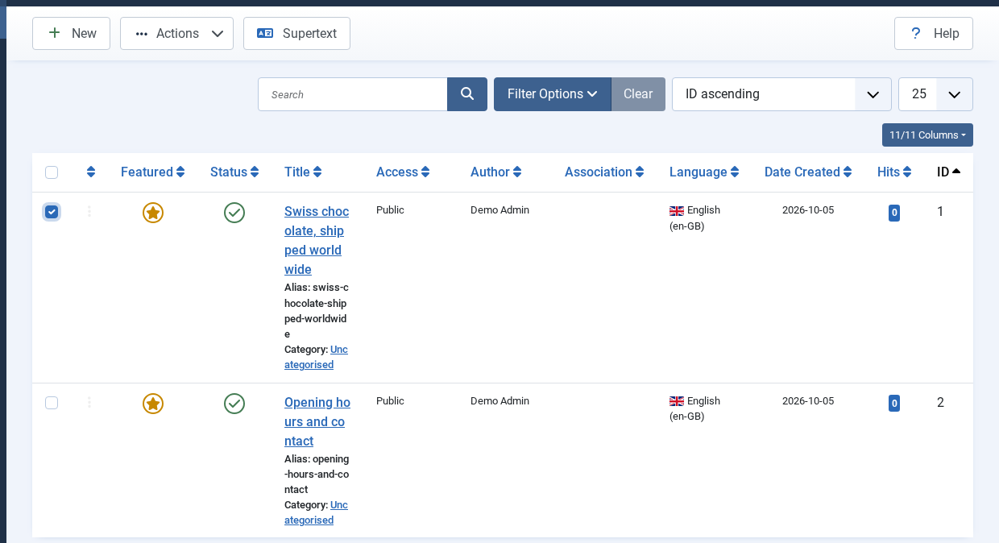
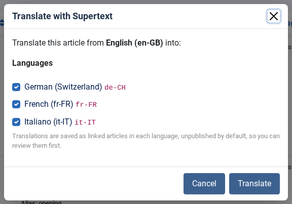
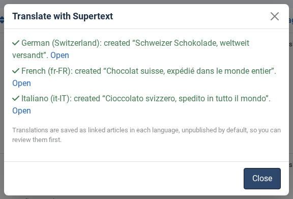
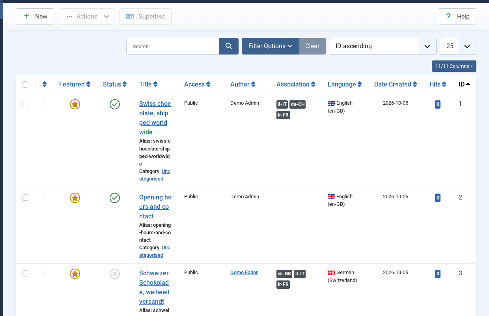
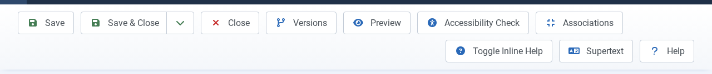
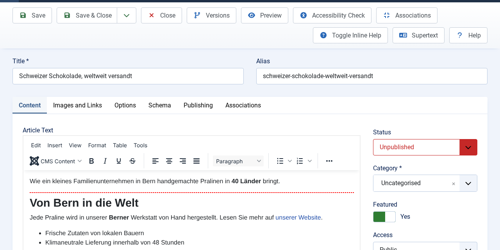
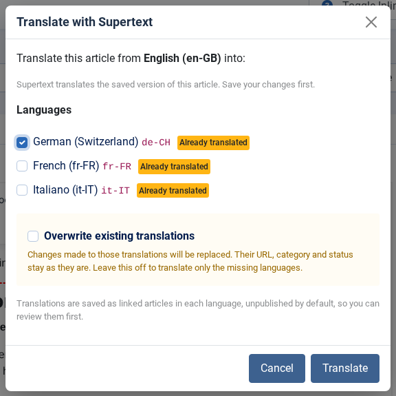

# User guide — Supertext Translation for Joomla

For editors. Once an administrator has set up the plugin (see [INSTALLATION.md](INSTALLATION.md)), you translate articles from the Joomla backend with one click. Supertext writes the translation; you review and publish it.

## Try it on the demo

The Supertext Joomla demo (ask Supertext for the address and a backend login) has two English sample articles and German (Switzerland), French and Italian set up as languages. Translate an article as described below, then open it in the other language on the site.

## Translate articles from the list

*Screenshots: Joomla 6.1 with the demo content.*

1. Open **Content → Articles** and tick the article(s) you want to translate.
2. Click **Supertext** in the toolbar.

   

3. Tick the languages to translate into. Languages that don't have a translation yet are ticked for you.

   

4. Click **Translate**. It usually takes a few seconds per language. The dialog then lists each translation with an **Open** link.

   

Each translation is a new article in that language, linked to the original (you see the language badges in the **Association** column). It is **unpublished** (unless your administrator chose otherwise), keeps the original's category, featured setting, access and options, and gets a URL alias from the translated title.

## Translate from the article editor

While editing an article, the **Supertext** button is in the editor's toolbar too. It translates the **saved** version of the article, so save your changes first.

The new translations are added to the article's *Associations* tab straight away, so saving the article afterwards keeps them linked. If the same article is open in another browser tab, reload that tab before saving there.

## Review and publish

1. Click **Open** in the dialog (or open the translation from the Articles list).
2. Read the translation and adjust anything you'd phrase differently.
3. Set **Status** to *Published* and save.

## Translating again

If an article already has a translation in a language, the dialog marks it **Already translated** and leaves it unticked. Tick it and Supertext asks whether to **Overwrite existing translations**:

- **Off** (default): only the languages without a translation are translated; existing ones are skipped.
- **On**: the existing translation is replaced with a fresh translation of the current original. Edits made to the translation are lost. Its URL alias, category, status and other settings stay as they are.

## What gets translated

- Title
- Article text (intro and full text), with headings, bold and italic text, links, lists and tables kept
- Meta description and meta keywords
- Alt texts and captions of the intro and full-text images
- The labels of the article's links A, B and C
- Custom fields of the types Text, Textarea and Editor (if your administrator left that on)

## What is *not* translated

- Joomla plugin tags such as `{loadmodule mod_custom}` or `{loadposition sidebar}`: they are copied unchanged
- Images, link URLs, dates, numbers, tags and other custom field types: copied unchanged
- Categories, menus and modules (translate those by hand for now)
- Translations that already exist, unless you choose to overwrite them

## Formal and informal language

Your administrator can set each language to formal (*Sie/vous*) or informal (*du/tu*). Ask them if the tone doesn't fit your site.

## When something goes wrong

Problems are listed in red in the dialog, per article and language; the other languages still get translated.

| Message | What to do |
| --- | --- |
| *Supertext is not set up yet* | Ask your administrator to enter the API key. |
| *This article's language is "All"* | Set the article's language (e.g. English) in the editor, save, and try again. |
| *You are not allowed to …* | You need permission to create or edit articles in that category; ask your administrator. |
| *Too many requests to Supertext* | Wait a moment and try again. |
| *Your Supertext translation limit is exceeded* | Your organisation's Supertext volume is used up; contact your administrator. |
| *Timed out waiting …* | Very long article: try again, or ask your administrator to raise the timeout. |

## Tips

- Select several articles in the list to translate them in one go.
- Translations are machine translations of high quality, but always have a quick look before publishing: product names, prices and dates deserve a second glance.
